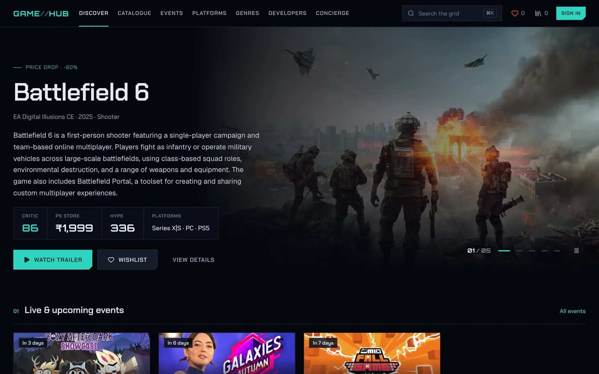
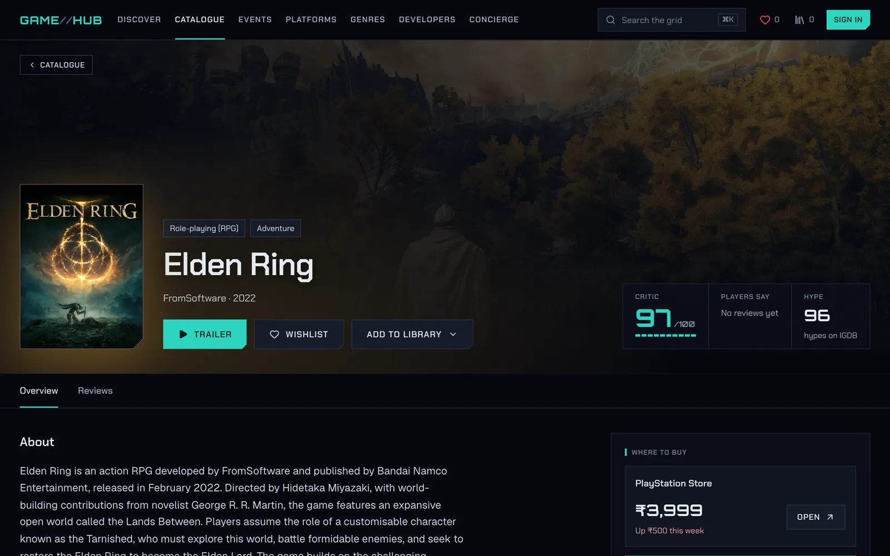
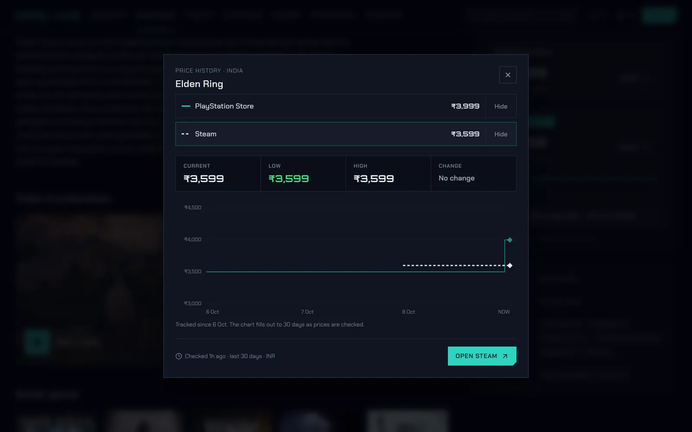
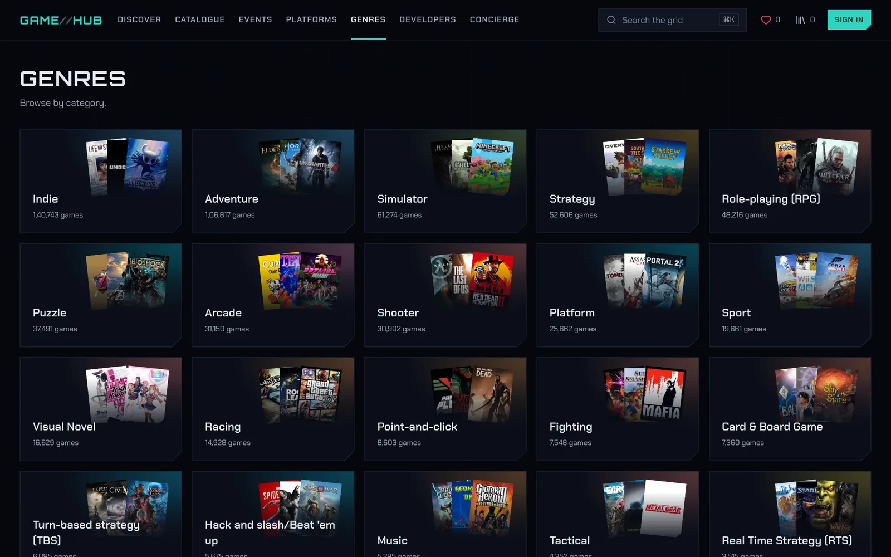
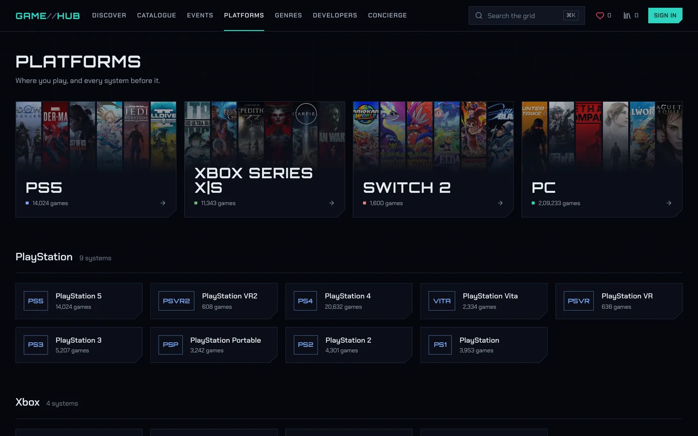
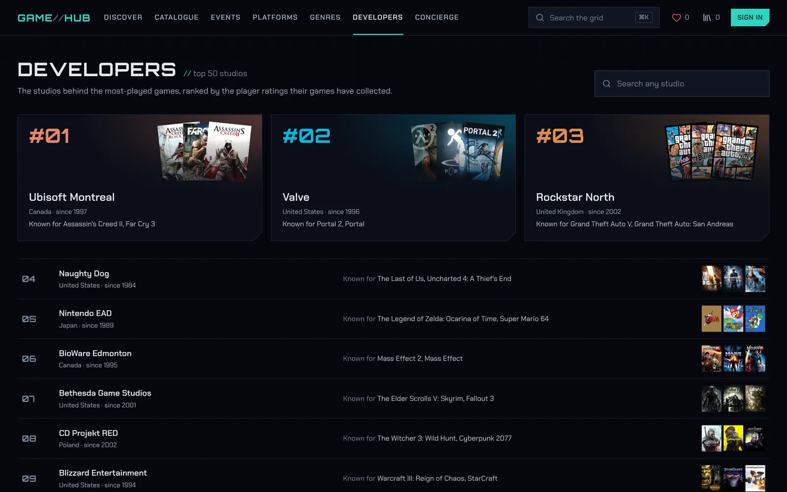
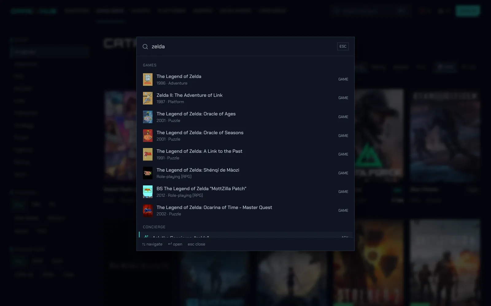
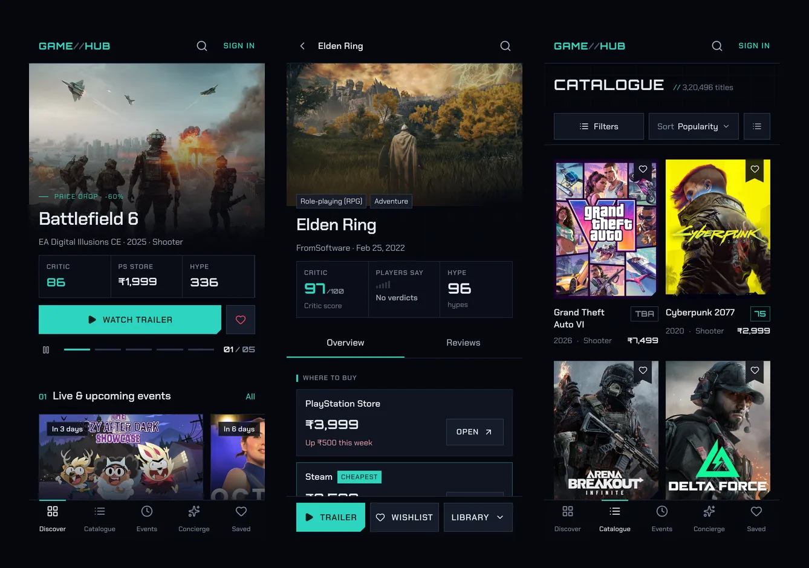
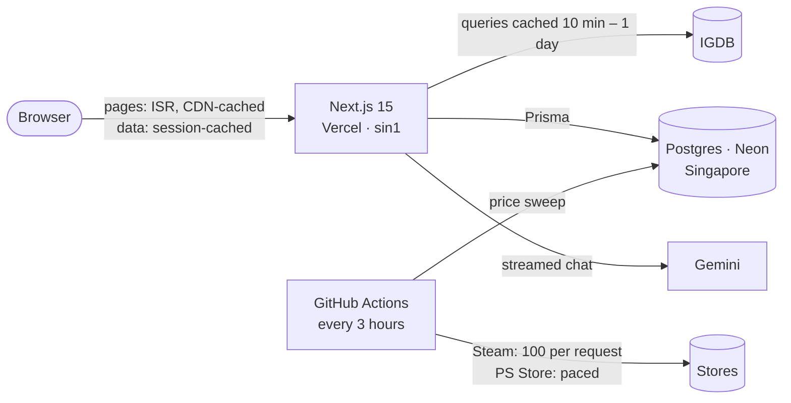

<div align="center">



<br />
<br />

# GAME//HUB

**Every game, every price drop, every showcase.**

Discover games, track PlayStation Store and Steam prices in rupees,<br />
follow live showcases and keep your library, all in one HUD-styled app.

<br />

<a href="https://gamehub-harsh.vercel.app/"></a>

[Design system](https://gamehub-harsh.vercel.app/design) &nbsp;&nbsp;·&nbsp;&nbsp; [Features](#features) &nbsp;&nbsp;·&nbsp;&nbsp; [Under the hood](#under-the-hood) &nbsp;&nbsp;·&nbsp;&nbsp; [Run it locally](#run-it-locally)

<br />

       

</div>

<br />

## Features

### Discover
A hero carousel of recent, well-rated games with their key art, critic score and best price, followed by live and upcoming showcases, this week's price drops, what's trending (by hype or by rating) and the latest releases. The first screen is server-rendered, so the art arrives with the page.

### Prices that actually matter here
- **PlayStation Store India and Steam India, side by side, in ₹.** When both sell a game, the cheaper store is flagged.
- **30-day price history** for both stores on one chart, with low, high and change at a glance.
- **Price drops** on Discover and an **"On sale only"** filter in the catalogue.
- The 2,000 most popular games are tracked before anyone opens them. Wishlisted and recently viewed games are re-checked every 3 hours, everything else daily.

### Your library
Wishlist any game (the price on the card is the best one we've seen), and sort your library onto three shelves: **Playing**, **Backlog** and **Finished**.

### Events
Live and upcoming gaming showcases in your local time, with countdowns, a "Live now" view and one-tap *Add to calendar*.

### Player verdicts
Reviews with a five-step verdict instead of stars: **Skip · Timepass · Worth it · Go for it · Masterpiece**, plus comments, likes and spoiler veils. Each game shows the community consensus next to the critic score.

### Concierge
An AI chat (Gemini 2.5 Flash) for "what should I play next?": recommendations, comparisons and what's live, streamed as it writes.

### Browse everything
- **Catalogue:** 300,000+ games, filtered by genre, platform, release year, critic rating or sale, in grid or list, with infinite scroll.
- **Genres:** each tile is built from the covers of that genre's best-known games.
- **Platforms:** today's consoles up front, every other system grouped by maker.
- **Developers:** a leaderboard of the studios behind the most-played games.
- **Search anywhere** with <kbd>⌘</kbd> <kbd>K</kbd>, which covers games, pages and genres, or hands your question to the Concierge.

<br />

<table>
  <tr>
    <td width="50%"></td>
    <td width="50%"></td>
  </tr>
  <tr>
    <td align="center"><sub><b>Game page</b>: art, scores and where to buy</sub></td>
    <td align="center"><sub><b>Price history</b>: both stores, 30 days, in ₹</sub></td>
  </tr>
  <tr>
    <td width="50%"></td>
    <td width="50%"></td>
  </tr>
  <tr>
    <td align="center"><sub><b>Genres</b>: tinted by their own games</sub></td>
    <td align="center"><sub><b>Platforms</b>: where you play, then by maker</sub></td>
  </tr>
  <tr>
    <td width="50%"></td>
    <td width="50%"></td>
  </tr>
  <tr>
    <td align="center"><sub><b>Developers</b>: a studio leaderboard</sub></td>
    <td align="center"><sub><b>⌘K</b>: search from anywhere</sub></td>
  </tr>
</table>

<p align="center">
  
  <br />
  <sub>Built for phones too: a bottom tab bar, sheets instead of menus, and actions in thumb reach.</sub>
</p>

<br />

## Design

**A HUD, not a theme.** The interface takes its cues from in-game heads-up displays and keeps them as accents, so the game art carries the colour.

- **Type with a job each.** *Chakra Petch* is the interface's voice (headings, nav, buttons, labels). *Orbitron* sets the logo, page titles and every number. *Geist* is used only for long reading text.
- **Cut corners, everywhere.** A chamfer system (`clip-path`, with focus rings drawn inside so they're never clipped) gives panels, buttons and covers their shape.
- **Colour with meaning.** Teal is the brand and everything you can press. Rose means live, wishlisted or destructive. Green means a deal. Each game page is tinted with the dominant hue of its own cover, extracted on the server.
- **A spacing scale with roles.** Gutters, page blocks, sections and grids each use one value on a 4px grid. Layouts own the gaps; components own their padding.
- **Primitives on Radix** (dialogs, sheets, tabs, menus, toggles) for keyboard and screen-reader behaviour, documented in a [**living style guide**](https://gamehub-harsh.vercel.app/design) rendered from production code.
- **Motion that explains.** A game's cover flies from its card into the page header (View Transitions API), hearts pop when you save, price lines draw in. All of it respects *reduced motion*.
- **Accessible by default.** Lighthouse accessibility scores 100, there are no axe violations, there's a skip link, focus is visible on every control, and labels stay stable while state changes.
- **Responsive by design, not by shrinking.** Phones get a tab bar and bottom sheets, tablets get centred panels and wider gutters, and desktop gets the full layout.

<br />

## Under the hood



**Fast without a backend of its own to babysit.**
- **IGDB responses are cached on the server** (Next.js data cache), so most navigations never wait on IGDB at all. List and search endpoints went from **~800 ms to 2–5 ms** once warm.
- **Game pages are incrementally regenerated** (refreshed every 5 minutes) and served from the CDN: **~2 ms** warm, versus 0.75–2 s rendered per view before.
- **Public API responses carry CDN and browser cache headers**, and client lists keep a session cache. Going *back* restores the page instantly at the exact scroll position, including everything loaded by infinite scroll.
- **Functions run in Singapore (`sin1`)**, next to the database and the Indian audience.

**Price tracking as a pipeline, not page views.**
- **A GitHub Action runs `scripts/price-sweep.ts` straight against the database every 3 hours**, so it isn't bound by serverless time limits.
- **Two tiers:** wishlisted, shelved or recently viewed games every run; the rest of the tracked catalogue daily. A daily seed adds IGDB's 2,000 most-rated games that are sold on either store.
- **Steam prices in batches of 100 per request; PlayStation Store pages fetched one at a time, gently paced.**
- **Only price changes are stored.** The history stays small (about 25–30 MB at steady state) and the latest price is never pruned.

**Lighthouse** (mobile, live site):

| Page | Performance | Accessibility | Best practices | SEO | CLS |
| --- | :---: | :---: | :---: | :---: | :---: |
| Discover | 94 | 100 | 100 | 92 | 0 |
| Game page | 85 | 100 | 100 | 100 | 0 |
| Catalogue | 82 | 100 | 100 | 100 | 0 |

<sub>Discover's SEO score reflects Next.js streaming the meta description to browsers. Crawlers and link-preview bots get it in the initial HTML, along with per-game Open Graph cards.</sub>

<br />

## Run it locally

**You'll need:** Node.js 20+, a PostgreSQL database (a free [Neon](https://neon.tech) project works), [IGDB API credentials](https://api-docs.igdb.com/#account-creation) (a Twitch developer app), a Google OAuth client and a [Gemini API key](https://aistudio.google.com/apikey).

```bash
git clone https://github.com/harshthakkr/game-hub.git
cd game-hub
npm install
cp .env.example .env      # then fill in the values below
npx prisma migrate deploy # create the tables
npm run dev               # http://localhost:3000
```

| Variable | What it's for |
| --- | --- |
| `DATABASE_URL` | Postgres connection string |
| `NEXT_PUBLIC_APP_URL` | The app's own URL (`http://localhost:3000` locally); used for metadata, sitemap and share cards |
| `NEXT_PUBLIC_BASE_URL` | IGDB API base: `https://api.igdb.com/v4` |
| `NEXT_PUBLIC_CLIENT_ID`, `NEXT_PUBLIC_CLIENT_SECRET` | IGDB (Twitch) app credentials; access tokens are minted and refreshed automatically |
| `AUTH_SECRET` | Auth.js secret (`npx auth secret`) |
| `AUTH_GOOGLE_ID`, `AUTH_GOOGLE_SECRET` | Google sign-in. Redirect URI: `<app url>/api/auth/callback/google` |
| `GEMINI_API_KEY` | The Concierge |
| `CRON_SECRET` | *Optional.* Guards `/api/cron/prices`, a manual short price refresh |
| `AUTH_TRUST_HOST` | Set to `true` when running `next start` outside Vercel |

**Prices locally:** prices are fetched the first time you open a game. To run the sweep yourself:

```bash
npx tsx --env-file=.env scripts/price-sweep.ts          # refresh whatever is due
npx tsx --env-file=.env scripts/price-sweep.ts --seed   # first add the popular catalogue
```

| Script | |
| --- | --- |
| `npm run dev` | Development server |
| `npm run build` | Prisma client + production build |
| `npm start` | Serve the production build |
| `npm run lint` | ESLint |

### Deploying
1. **Vercel.** Import the repo and add the variables above. Functions are pinned to Singapore in `vercel.json`.
2. **Price tracker.** In GitHub, add repository secrets `DATABASE_URL`, `IGDB_CLIENT_ID` and `IGDB_CLIENT_SECRET`. The workflow in `.github/workflows/price-tracker.yml` then runs every 3 hours from the default branch, and can be started by hand from the Actions tab (tick *Seed* for the first run).

<br />

## Project structure

```
app/
  (common)/          pages: Discover, catalogue, game, events, platforms,
                     genres, developers, wishlist, library, search, /design
  (auth)/register/   sign in · sign up
  api/               route handlers (games, prices, events, collection,
                     reviews, AI, cron) and Auth.js at api/auth/
components/
  ui/                design-system primitives (Radix-based) and layout roles
  overdrive/         product components: cards, heroes, sheets, palette…
lib/                 server: IGDB client + cache, prices, Steam, PS Store,
                     price catalogue, genres, platforms, developers, accent
utils/               shared helpers, hooks, view transitions, scroll memory
prisma/              schema and migrations
scripts/             price sweep (run by GitHub Actions)
```

<br />

## Credits

Game data from [IGDB](https://www.igdb.com/). Prices are read from the public PlayStation Store and Steam store pages for India. GAME//HUB is a personal project and is not affiliated with Sony Interactive Entertainment, Valve, Microsoft, Nintendo or IGDB/Twitch. All game titles, covers and artwork belong to their respective owners.

<br />

<div align="center">

Designed and built by **Harsh Thakkar**

[X / Twitter](https://x.com/harshthkkr) &nbsp;·&nbsp; [GitHub](https://github.com/harshthakkr)

</div>
